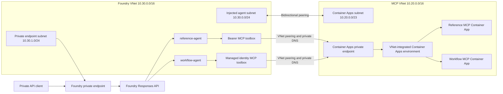

## Target Architecture



Both Container Apps use the same image with different startup commands. Each
server exposes one Streamable HTTP endpoint at `/mcp` and one allowed tool.

> [!IMPORTANT]
> All application data planes must reject public traffic. Azure Resource Manager
> remains the management plane, but Foundry, Container Apps, Container Registry,
> Storage, Search, Cosmos DB, and Log Analytics must use private connectivity.
> Deployment fails acceptance if any service endpoint is reachable from a client
> outside the approved virtual networks.

The Foundry account uses Standard Agent Setup with customer VNet injection at
creation time. A Foundry private endpoint secures inbound API access. VNet
injection provides the separate outbound path used by Hosted Agents and Toolbox
calls to reach the private MCP endpoints.

## Phase 1 Prerequisites

1. Select the target subscription and tenant with `az login` and
   `az account set`.
2. Reserve non-overlapping RFC 1918 address spaces for both virtual networks.
  The provisional ranges are `10.20.0.0/16` for MCP and `10.30.0.0/16` for
  Foundry. Confirm them against the organizational network before peering.
3. Confirm the operator can create virtual networks, private endpoints, private
  DNS zones, role assignments, Foundry resources, and Entra applications.
4. Confirm Central India supports the selected model, Hosted Agents, Standard
  Agent Setup, network injection, and all required dependency SKUs.
5. Create the Foundry account with Standard Agent Setup and VNet injection.
  Network injection cannot be added to a Hosted Agent account later.
6. Record the private project endpoint in this form:
   `https://<resource>.services.ai.azure.com/api/projects/<project>`.
7. Confirm `azd ai` commands can target the preprovisioned private project.

Do not run the current `azure.yaml` deployment before the private Foundry
account, project, dependencies, role assignments, and DNS paths exist. The
declarative Foundry provider does not provision VNet injection or private
endpoints.

## Phase 2 Private Network Foundation

Create these resources in Central India:

* MCP VNet `vnet-responseapi-mcp-cin-dev` using `10.20.0.0/16`
* Container Apps infrastructure subnet using `10.20.0.0/23`, delegated to
  `Microsoft.App/environments`
* MCP private endpoint subnet using `10.20.2.0/24`
* Foundry VNet `vnet-responseapi-foundry-cin-dev` using `10.30.0.0/16`
* Foundry injected agent subnet using `10.30.0.0/24` with the delegation
  required by Standard Agent Setup
* Foundry private endpoint subnet using `10.30.1.0/24`
* Bidirectional VNet peering without gateway transit
* Network security groups that permit required HTTPS, DNS, and platform traffic

Create private DNS zones and link them to both VNets where resolution is
required. At minimum, configure the zones used by Foundry, Container Apps,
Container Registry, Storage, Search, Cosmos DB, and Azure Monitor. For an
Azure Container Apps private endpoint in Central India, use
`privatelink.centralindia.azurecontainerapps.io` and link it to both VNets.

## Phase 3 Private Platform Services

Provision or replace these services:

* Premium Azure Container Registry with a private endpoint and public network
  access disabled
* Azure Monitor Private Link Scope connected to the Log Analytics workspace,
  with public ingestion and query disabled
* Workload-profiles Container Apps environment created on the MCP infrastructure
  subnet, with a private endpoint and public network access disabled
* Internal-ingress Container Apps for `reference-mcp` and `workflow-mcp`
* Standard Foundry account with creation-time VNet injection
* Foundry private endpoint with public network access disabled
* Private Storage, Azure AI Search, and Cosmos DB dependencies required by
  Standard Agent Setup
* Microsoft Entra app registration for the workflow MCP audience

The existing Container Apps environment cannot be converted because its network
type was fixed without VNet integration at creation. Create a new internal
environment, migrate the MCP app, validate private connectivity, and then delete
the public environment and app.

Microsoft documents internal Container Apps as the tested private MCP host, but
does not document a direct Container Apps private endpoint as a Foundry Toolbox
target. Before provisioning Foundry dependencies, run a proof of concept from
the Foundry VNet that validates private DNS, TLS, MCP initialization, tool
listing, and one tool call through the Container Apps private endpoint. Stop the
deployment if any request uses public routing or the private endpoint is not
reachable through VNet peering.

Build the image from the repository root and push it to the registry. Deploy the
same image twice with these commands:

```text
reference-mcp:
  uvicorn responseapi.mcp_bearer:app --host 0.0.0.0 --port 8000

workflow-mcp:
  uvicorn responseapi.mcp_workload:app --host 0.0.0.0 --port 8000
```

Configure `reference-mcp` with:

* `ENVIRONMENT=azure`
* `BEARER_MCP_ENDPOINT=https://<reference-app>/mcp`
* `BEARER_MCP_TOKEN` sourced from a Container Apps secret

Configure `workflow-mcp` with:

* `ENVIRONMENT=azure`
* `WORKLOAD_MCP_ENDPOINT=https://<workflow-app>/mcp`
* `WORKLOAD_IDENTITY_AUTH_MODE=external`

Enable Container Apps authentication on `workflow-mcp`. Require Microsoft Entra
authentication, reject unauthenticated requests with HTTP 401, and set the
allowed token audience to `api://<workflow-app-client-id>`. Restrict the allowed
principal to the Foundry project's system-assigned managed identity. The app
also requires the trusted `X-MS-CLIENT-PRINCIPAL-ID` header injected by the
Container Apps authentication sidecar.

## Phase 4 MCP Project Connections

Set the current Foundry project:

```bash
azd ai project set "$FOUNDRY_PROJECT_ENDPOINT"
```

Register the bearer-token endpoint. Supply the secret from a secure shell
variable or secret store and do not commit it:

```bash
azd ai connection create reference-mcp-connection \
  --kind remote-tool \
  --target "$BEARER_MCP_ENDPOINT" \
  --auth-type custom-keys \
  --custom-key "Authorization=Bearer $BEARER_MCP_TOKEN"
```

Register the workload endpoint with the Foundry project managed identity:

```bash
azd ai connection create workflow-mcp-connection \
  --kind remote-tool \
  --target "$WORKLOAD_MCP_ENDPOINT" \
  --auth-type project-managed-identity \
  --audience "api://$WORKFLOW_APP_CLIENT_ID"
```

Verify each connection from the Foundry project before creating agents. A 401
from the first endpoint indicates a missing or mismatched custom header. A 401
or 403 from the second indicates an audience, tenant, or allowed-principal
mismatch.

## Phase 5 Foundry Hosted Agents

Set these environment variables:

```text
FOUNDRY_PROJECT_ENDPOINT
FOUNDRY_MODEL_DEPLOYMENT
BEARER_MCP_ENDPOINT
WORKLOAD_MCP_ENDPOINT
BEARER_MCP_CONNECTION_NAME
WORKLOAD_MCP_CONNECTION_NAME
```

Preview and create the two versions:

```bash
uv run responseapi-provision --dry-run
uv run responseapi-provision
```

The command creates:

* `reference-agent` with only `lookup_reference` through
  `reference-mcp-connection`
* `workflow-agent` with only `continue_workflow` through
  `workflow-mcp-connection`

## Phase 6 Responses API Validation

Acquire a Foundry token without printing it to logs:

```bash
AGENT_TOKEN=$(az account get-access-token \
  --scope "https://ai.azure.com/.default" \
  --query accessToken -o tsv)
```

Call the stateless agent with storage disabled:

```bash
curl -X POST "$FOUNDRY_PROJECT_ENDPOINT/openai/v1/responses" \
  -H "Authorization: Bearer $AGENT_TOKEN" \
  -H "Content-Type: application/json" \
  -d '{
    "agent": {"type": "agent_reference", "name": "reference-agent"},
    "input": "Look up the MCP registration behavior",
    "store": false
  }'
```

Call the stateful agent, retain its response `id`, and continue it:

```bash
curl -X POST "$FOUNDRY_PROJECT_ENDPOINT/openai/v1/responses" \
  -H "Authorization: Bearer $AGENT_TOKEN" \
  -H "Content-Type: application/json" \
  -d '{
    "agent": {"type": "agent_reference", "name": "workflow-agent"},
    "input": "Build the MCP containers",
    "store": true
  }'

curl -X POST "$FOUNDRY_PROJECT_ENDPOINT/openai/v1/responses" \
  -H "Authorization: Bearer $AGENT_TOKEN" \
  -H "Content-Type: application/json" \
  -d '{
    "agent": {"type": "agent_reference", "name": "workflow-agent"},
    "input": "Now register them in Foundry",
    "previous_response_id": "<FIRST_RESPONSE_ID>",
    "store": true
  }'
```

The same agents can be tested from the Foundry playground. No custom chat UI is
required.

## Phase 7 Acceptance Gates

* Anonymous and incorrect-token calls to `reference-mcp` return HTTP 401
* The custom-keys Foundry connection can invoke only `lookup_reference`
* Anonymous calls to `workflow-mcp` return HTTP 401
* Only the project managed identity can invoke `continue_workflow`
* `reference-agent` succeeds with `store=false` and no prior response ID
* `workflow-agent` continues from a valid `previous_response_id`
* Container and Foundry diagnostics contain no bearer token values
* Agent definitions use `allowed_tools` and least-privilege project connections
* Public network access is disabled on Foundry and every dependency data plane
* MCP FQDNs resolve to private addresses from the Foundry injected subnet
* Foundry FQDNs resolve to private endpoint addresses from approved client VNets
* MCP and Foundry endpoints are unreachable from a public test runner
* ACR image pulls and Log Analytics ingestion succeed after public access is
  disabled

> [!WARNING]
> Current Hosted Agent documentation contains conflicting statements about
> whether the Responses protocol endpoint can remain publicly addressable during
> preview. Validate the deployed endpoint from outside the private network. Do
> not accept the Hosted Agent deployment if an external client can reach it,
> even when authentication rejects the request.

## Implementation Order

1. Delete the currently public bearer MCP app after approval.
2. Create both VNets, subnets, network security groups, and peerings.
3. Create private DNS zones and VNet links.
4. Create the internal Container Apps environment in the MCP VNet.
5. Make ACR and monitoring private, then validate image pull and log ingestion.
6. Deploy both internal MCP apps and validate them from a private test client.
7. Create the Standard Foundry account and dependencies with private networking
  and creation-time VNet injection.
8. Create the Foundry private endpoint and disable every public data plane.
9. Create the MCP project connections, toolboxes, and Hosted Agents.
10. Execute private stateless and stateful acceptance calls.
11. Run external negative tests and delete superseded public resources.